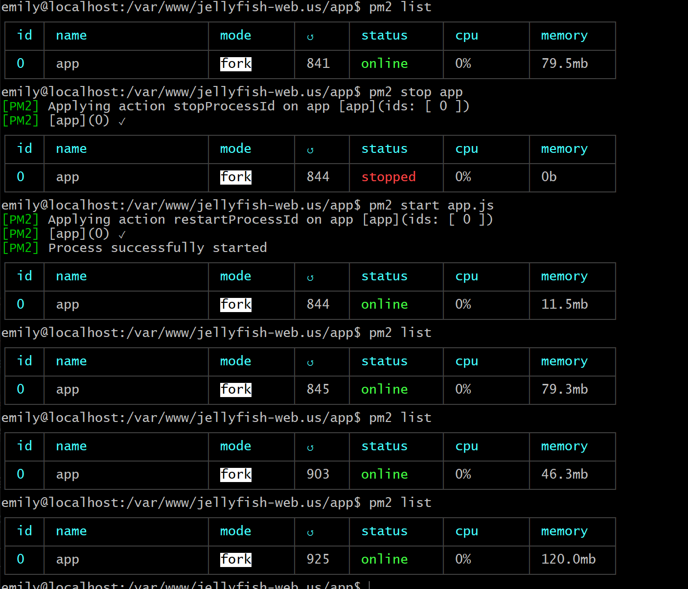
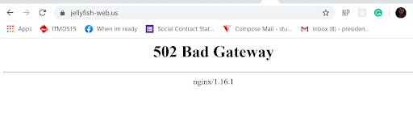

For this beta cycle, we have implemented two beta releases. The first one being v1.1.0 where we fully and successfully implemented Google OAuth and Passport. Connect-ensure-login has been added which prevents users from using the web application by visiting `/flight` sans login. Additionally, we have made it where flight.pug displays the logged-in user’s name. Our routers have also been cleaned up with a new router created specifically for `/flight`. The second release consisted mainly of database work. Per Stolley’s counsel, we focused on the transition of SQLite3 to mySQL. With the help of *Sequelize*, it made the transition and connection to the database simpler.

One of the challenges we’ve encountered for the beta release is the transition from SQLite3 to mySQL. In our efforts to incorporate mySQL, we found a module that works well with NodeJS which is *Sequelize*. As we mentioned in our previous report, *Sequelize* is an Object Relational Mapper. We decided to use this since its documentation and syntax were easy to learn and implement. It also fits well into our project since our database mostly consists of ‘Trips’ which would be easier to implement as an object.

Adding on getting our project on our Linode server has been a bit difficult. One of the first problems we encountered was pushing our project into our server. We kept getting an error saying the repo we wanted to push to was not a github working base. We had to do a force push to be able to get our files on our server. After that we installed pm2 to run our project. We have been having trouble displaying our project on it. We have received a 502 Bad Gateway error when using our domain (jellyfish-web.us). Currently trying to troubleshoot this issue by rebooting our server and reloading our project. Our post-received was updated to be able to load the app.js from our project and we removed the html file we first created to test it out. When we tried to run pm2 with our app.js the status reports online and the memory tells us there is something happening on our page. However, when we load our page we get the 502 error.
I have noticed that when I run pm2 list the memory changes from 121.3mb to 46.3mb.

We are going to go back and check our post-receive files to get our project on our server. We hope to have this issue solved for our final release.

Based on our challenges and progress, we anticipate a successful rendition of our website on a server. In addition to that, we will be getting the user interface up.

Apart from this, the challenge that hit us the hardest is this goddamn quarantine. Like I don’t get how people work with their families???!?!? We live with crazy people, okay???! Trying to find a productive routine is quite hard when the couch or bed is literally at the corner of my eye. Of course, that’s not an excuse to be subpar, but it is truly demotivating and despairing.

We hope everyone is alive and well!
