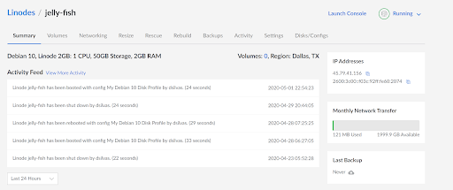
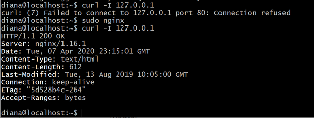
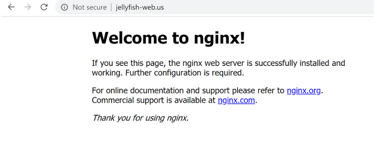
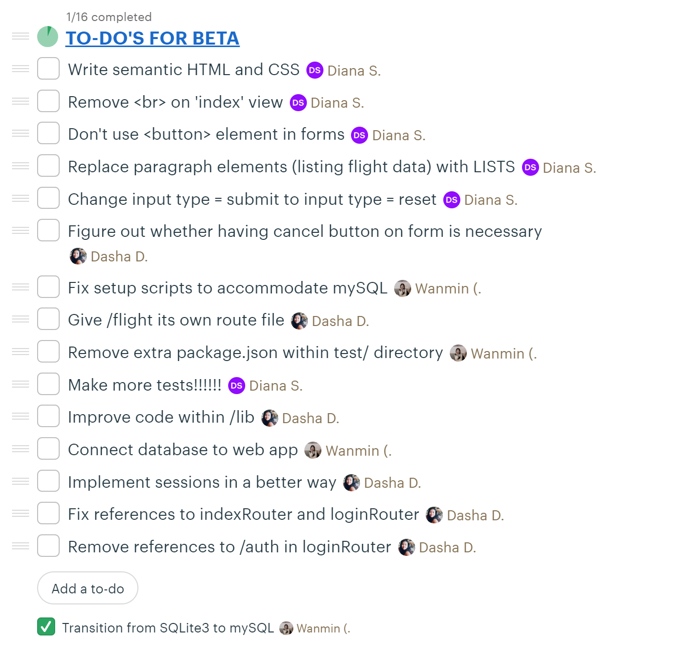

# Weekly Progress

## Report for April 2
Going off on Wednesday's lecture our group has decided to go with Linode Server for our web application. We all pitched in and purchased a basic server. Root has been disabled and everyone in the group has access as their own users for the server. The main user that we are going to run on is diana@45.79.41.156.

On this server we have installed git version 2.20.1 and NodeJS. To add on to that, we have also enabled the firewall. On our SSH server, we installed fail2ban to protect our server. Nginx has been configured to allow both http and https on our pages. We will be running Nginx on Debian 10. In terms of maintenance with our server, we have made the decision to shut it down for now in order to save money and keep it secure. There was an issue trying to add authentication keys so we plan on working on adding them to keep our server more secure. 

We have also purchased a domain: jellyfish-web.us on active domain. When the server is up and running you would be able to use this link or the IP provided by Linode to reach our web server which in this case is nginx.

GitHub was alerting us of security risks with our project with the dependencies we had. We discovered that a few dependencies weren’t updated and have since resolved the issues by updating everything in our package-lock.json to the latest version. 

As mentioned in a previous comment on Basecamp from last week’s report, we have fully implemented Passport JS and have made improvements. Besides being fully functional, we have also tidied up the routers, and authentication functionalities are now under the `/auth` path. In addition to Passport, we’ve also included `connect-ensure-login` as a dependency. This is a light middleware which safeguards pages from being accessed if there is no user logged in. We had a slight hiccup with implementing this since a failure would redirect to the wrong page. However, we’ve resolved this and everything works fine now! We’ll be making a minor release for this.

The next step in terms of user authentication is to have the user credentials match or registered to the database. However,  for our database, we are still in the process of transitioning from SQLite3 to mySQL. We are trying to get a script running to connect to a database that will be created to hold the user’s information. When we have the database connection, everyone will have it on their local environments. Then, we can proceed with adding user credentials for user authentication as mentioned above. 

For the server we need to add a file to track the specific parts of etc/nginx and continue to config our Nginx. We will also be adding certbot to allow users to use https (to avoid the “Not secure” message).

As mentioned in our previous report, this is a list of the milestones we have planned, with each of them potentially being a minor release:

- Connecting the database to the web application (GET and POST of user information and trip data)
- Completed implementation of Passport JS
- Significant progress on interface (UI/UX)

## Report for March 26
We have created a new Github repository for our beta cycle in order to separate everything and see new reiterations of what we are doing? All the previous files from the alpha cycle have been copied into the beta repo.

We have made the switch from SQLite3 to mySQL. We wanted to ensure that post-alpha release we would have a more stable database to work with as we continue to make new releases and go through new cycles.  We have created a to-do list based off of Stolley’s feedback on our alpha release and our group members’ thoughts.

More specifically, we are in the process of fully implementing Passport to authorize sign-in and registration with Google Authentication. We are now able to get user’s information which includes their full name, profile image, and email address. With the feedback we received from Stolley, we will be tweaking our routers to improve code flow.

We will also be moving constant variables to our *.env* file. In the case of our *flight-data.js*, we’ll be applying this to variables: *hostname* and *x-rapidapi-host*.

Moving forward we will be meeting with Professor Stolley sometime next week. We will also be scheduling our own meetings to discuss how we are going to move forward to complete the to do list.

Here is a list of the milestones we have planned, with each of them potentially being a minor release:

- Connecting the database to the web application (GET and POST of user information and trip data)
- Completed implementation of Passport JS
- Significant progress on interface (UI/UX)
