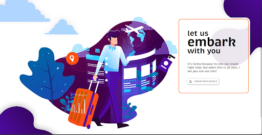
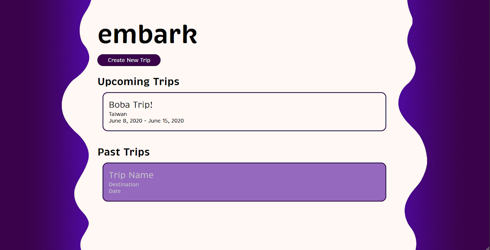
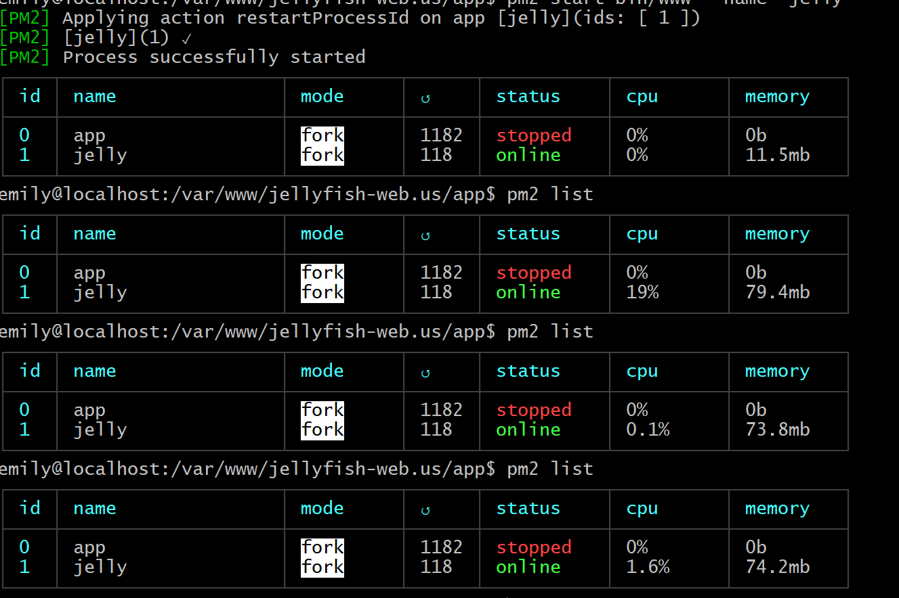

# Final Release Report

## Interface
For the interface, we have made significant progress.
Here are some screenshots of *embark* as of May 7:

### Login page

### Home/ Feed page

Optimally, we would have a better interface which would adjust to more varieties of view widths, but as of now this is what we have.

## Database
Our database was created using Sequelize to implement MySQL. We have three tables as mentioned before: User, Trips, and Transportation. The Users table stores an ID, name of user, date trip was created, and date trip was last updated. The Trips table consists of an ID, name of the trip, start date, return date, and transportation mode. The last table is Transportation which touches on specific trip details such as: trip’s ID, company name, mode, status, and seat.

## Linode Server
We were able to successfully deploy our system on a linodes server. Some issue we encountered was with the database not being able to run on our server. However at the end we were able to install mysql to our server. Our system is currently being monitored using PM2.

PM2

## Challenges
We encountered a lot of bumps while working on a short development cycle. Creating a full stack web application is so difficult—not only because of its implementation, but as beginners, we had a really hard time wrapping our heads around how we were even going to start. There are many moving parts to a webapp and trying to focus on building one part while knowing that we didn’t know how to do the rest was kind of distracting. I guess you can say it was the anxiety of not knowing what we were actually doing that made it difficult to process the entire project.

Working on *embark* gave us the opportunity to dip our feet into backend and client-side development. One of which is the learning curve for the new technologies/ modules we decided to use. We had to focus and invest our time to learn on our own. We developed the habit and appreciation for looking through documentation. Learning *Passport* and *connect-ensure-login* for authentication, *Sequelize* for database integration, and even JSDocs were some of the things we had to face. Transitions to different technologies also happened. The team had more recent experience with using MongoDB than mySQL, so by the beta-release (with the move to mySQL), we had to relearn mySQL syntax.

Setting up the server became quite frustrating at some point. There was a lot of troubleshooting involved. One of the issues we had was pushing our system to our server. We kept receiving errors during this step. Another problem we encountered was not being able to deploy our system even when we ran PM2, returning no errors. It was very interesting learning how to set up the server and configuring it.

The interface didn’t present too much trouble compared to the rest. It was a bit scary to use *pug* since it was new and we didn’t like the documentation too much. We jumped over this problem by finding a good HTML to pug converter. The most difficult thing about the interface might just be the lack of time. With all of the harder parts being our main focus, this pushed our strength with UI/UX to the back and we didn’t use as much time to work on it. The interface was a bit rushed, but we’re very proud of it nonetheless.

One unexpected skill we’ve learned is to work together remotely. It definitely became a challenge that hurt our motivation and morale. Despite these challenges, we’re able to confidently say that we’re proud of how much we’ve done with *embark* and that we’re looking forward to ~*embark*~ into summer.

## Future Developments
### Interface
A mobile-compatible interface should be prioritized. After which, user actions (e.g. hover, click) on the interface should be added. This means that if one were to hover over a button the color should change accordingly. 

We also believe that the graphics can be significantly improved and that *embark* can have a more cohesive look and feel to it. Right now, the graphic in the login page is not of the best quality so we definitely want that to be improved.

### Functionality
As of May 7, we’re working on displaying the database results to the interface. Hopefully we have it sorted out by the end of May 8. Further into the future, we want existing trips to be editable. We think that this would be easy to implement if we have the app-database connection sorted out.

We think this project is a good idea and is scalable with so many possibilities. We can definitely see it growing and having more functionalities like connecting to an API with data for trains or the driving route. If we want to think bigger, we can even let users connect to one another and have a trip which they can collaborate on. But that’s a whole different (more intense) venture. (Let us know if u wanna invest in us ;) Classmates get 5% off. LIMITED TIME OFFER!)
